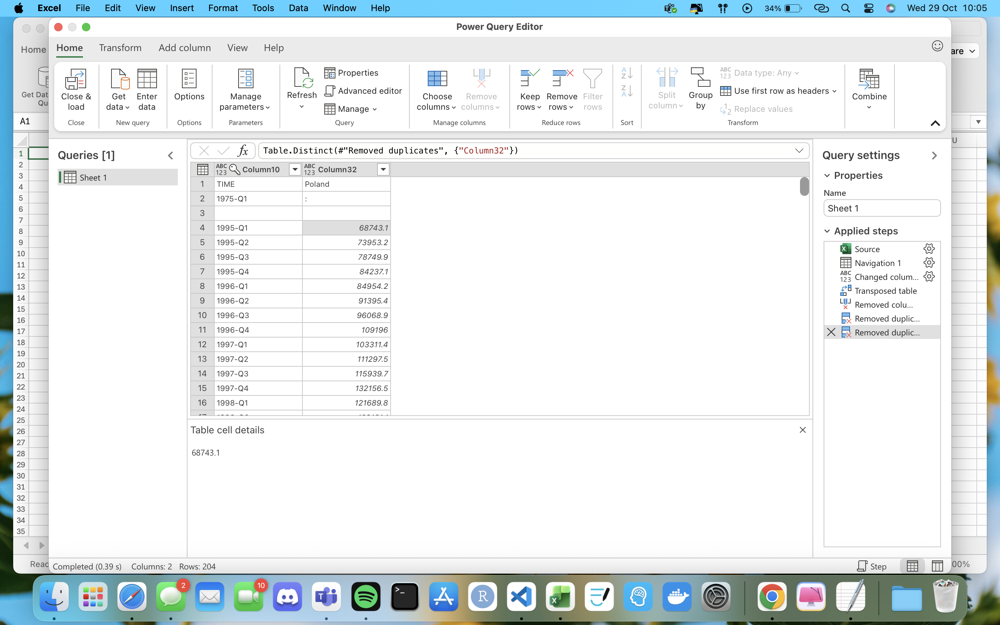
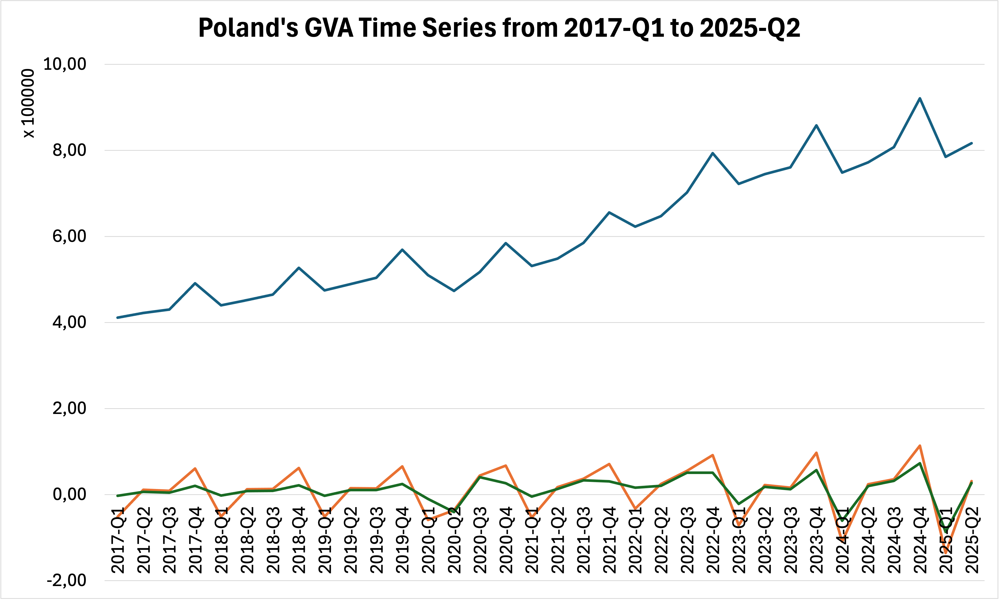

# Laboratory 01: Removing Trend and Seasonality in Time Series

Download the data on Gross Value Added (GVA) for Poland from the [Eurostat](https://ec.europa.eu/eurostat) website. Perform a time series analysis and remove both the trend and seasonality using Excel and R. In your work, present the methods used and the formulas applied to remove the trend and seasonality.

# Solution

### Gross Value Added (GVA) Analysis – Removing Trend and Seasonality

During the analysis of the **Gross Value Added (GVA)** data for Poland, I processed the quarterly data by extracting the columns corresponding to **time** and **GVA values**.

### Removing the Trend
The trend was removed using first differences of consecutive values, according to the formula:

$$
\text{GVA}_{t}^\text{detrended} = \text{GVA}_{t} - \text{GVA}_{t-1}
$$

This removed the long-term increase or decrease from the time series, allowing for better analysis of seasonality.

### Removing Seasonality
To remove seasonality, the quarterly indicators were calculated as follows:

$$
\text{raw}_{Q_n} = \mu_{Q_n}
$$

and the adjusted quarterly indicators:

$$
\text{cleaned}_{Q_n} = \mu_{Q_n} - \frac{1}{m}\sum_{i=1}^{m} \mu_{Q_m}
$$

The final removal of seasonality was performed using the formula:

$$
\text{GVA}_{t}^\text{final} = \text{GVA}_{t}^\text{detrended} - \text{cleaned}_{Q_n}
$$

### Additional Notes
The project repository contains both the solution implemented in **Excel** and the version prepared using an **R script**, allowing for comparison of results and applied methods across different tools.
