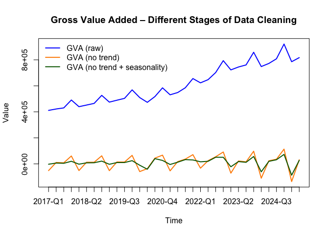

# Load the dplyr library for data manipulation

This step loads the `dplyr` package, which will be used for data
manipulation tasks such as filtering and mutating columns.

    library(dplyr)

    ## 
    ## Attaching package: 'dplyr'

    ## The following objects are masked from 'package:stats':
    ## 
    ##     filter, lag

    ## The following objects are masked from 'package:base':
    ## 
    ##     intersect, setdiff, setequal, union

# Read the GVA dataset from CSV

Here we import the quarterly GVA data from a CSV file.

    data <- read.csv(file = 'data/processed_gva.csv', sep = ';')

# Convert columns to numeric

We ensure the `Year` and `GVA` columns are numeric for calculations.

    data$YEAR <- as.numeric(data$YEAR)
    data$GVA <- as.numeric(data$GVA)

# Inspect the dataset

Check the data after importing to confirm values.

    data

    ##        TIME YEAR QUARTER      GVA
    ## 1   1995-Q1 1995       1  68743.1
    ## 2   1995-Q2 1995       2  73953.2
    ## 3   1995-Q3 1995       3  78749.9
    ## 4   1995-Q4 1995       4  84237.1
    ## 5   1996-Q1 1996       1  84954.2
    ## 6   1996-Q2 1996       2  91395.4
    ## 7   1996-Q3 1996       3  96068.9
    ## 8   1996-Q4 1996       4 109196.0
    ## 9   1997-Q1 1997       1 103311.4
    ## 10  1997-Q2 1997       2 111297.5
    ## 11  1997-Q3 1997       3 115939.7
    ## 12  1997-Q4 1997       4 132156.5
    ## 13  1998-Q1 1998       1 121689.8
    ## 14  1998-Q2 1998       2 129131.1
    ## 15  1998-Q3 1998       3 135117.9
    ## 16  1998-Q4 1998       4 154674.3
    ## 17  1999-Q1 1999       1 130105.4
    ## 18  1999-Q2 1999       2 141362.5
    ## 19  1999-Q3 1999       3 147875.8
    ## 20  1999-Q4 1999       4 176650.0
    ## 21  2000-Q1 2000       1 150188.2
    ## 22  2000-Q2 2000       2 159789.7
    ## 23  2000-Q3 2000       3 165655.1
    ## 24  2000-Q4 2000       4 191874.4
    ## 25  2001-Q1 2001       1 161444.9
    ## 26  2001-Q2 2001       2 169730.3
    ## 27  2001-Q3 2001       3 172356.2
    ## 28  2001-Q4 2001       4 195044.6
    ## 29  2002-Q1 2002       1 169021.1
    ## 30  2002-Q2 2002       2 173442.8
    ## 31  2002-Q3 2002       3 177919.5
    ## 32  2002-Q4 2002       4 198728.4
    ## 33  2003-Q1 2003       1 172663.5
    ## 34  2003-Q2 2003       2 183454.2
    ## 35  2003-Q3 2003       3 183902.8
    ## 36  2003-Q4 2003       4 209265.7
    ## 37  2004-Q1 2004       1 187771.2
    ## 38  2004-Q2 2004       2 205158.9
    ## 39  2004-Q3 2004       3 202256.8
    ## 40  2004-Q4 2004       4 234379.0
    ## 41  2005-Q1 2005       1 206156.4
    ## 42  2005-Q2 2005       2 213849.8
    ## 43  2005-Q3 2005       3 214178.1
    ## 44  2005-Q4 2005       4 239041.7
    ## 45  2006-Q1 2006       1 219356.9
    ## 46  2006-Q2 2006       2 226107.1
    ## 47  2006-Q3 2006       3 230218.1
    ## 48  2006-Q4 2006       4 265540.3
    ## 49  2007-Q1 2007       1 242848.3
    ## 50  2007-Q2 2007       2 249025.0
    ## 51  2007-Q3 2007       3 251557.2
    ## 52  2007-Q4 2007       4 294929.5
    ## 53  2008-Q1 2008       1 266404.9
    ## 54  2008-Q2 2008       2 272572.1
    ## 55  2008-Q3 2008       3 274052.3
    ## 56  2008-Q4 2008       4 313371.6
    ## 57  2009-Q1 2009       1 291329.2
    ## 58  2009-Q2 2009       2 292509.4
    ## 59  2009-Q3 2009       3 295294.0
    ## 60  2009-Q4 2009       4 342328.8
    ## 61  2010-Q1 2010       1 293532.1
    ## 62  2010-Q2 2010       2 306180.5
    ## 63  2010-Q3 2010       3 310619.9
    ## 64  2010-Q4 2010       4 357495.4
    ## 65  2011-Q1 2011       1 317049.9
    ## 66  2011-Q2 2011       2 329722.2
    ## 67  2011-Q3 2011       3 336299.9
    ## 68  2011-Q4 2011       4 391006.1
    ## 69  2012-Q1 2012       1 336547.1
    ## 70  2012-Q2 2012       2 351206.9
    ## 71  2012-Q3 2012       3 352593.5
    ## 72  2012-Q4 2012       4 396126.2
    ## 73  2013-Q1 2013       1 339294.3
    ## 74  2013-Q2 2013       2 351319.9
    ## 75  2013-Q3 2013       3 353491.8
    ## 76  2013-Q4 2013       4 407683.5
    ## 77  2014-Q1 2014       1 353386.1
    ## 78  2014-Q2 2014       2 366725.0
    ## 79  2014-Q3 2014       3 373465.9
    ## 80  2014-Q4 2014       4 421844.4
    ## 81  2015-Q1 2015       1 371802.8
    ## 82  2015-Q2 2015       2 386531.9
    ## 83  2015-Q3 2015       3 391631.1
    ## 84  2015-Q4 2015       4 456514.4
    ## 85  2016-Q1 2016       1 387565.7
    ## 86  2016-Q2 2016       2 397645.3
    ## 87  2016-Q3 2016       3 400700.8
    ## 88  2016-Q4 2016       4 462848.6
    ## 89  2017-Q1 2017       1 411240.3
    ## 90  2017-Q2 2017       2 421998.0
    ## 91  2017-Q3 2017       3 430320.3
    ## 92  2017-Q4 2017       4 490967.8
    ## 93  2018-Q1 2018       1 439707.9
    ## 94  2018-Q2 2018       2 452196.1
    ## 95  2018-Q3 2018       3 464846.4
    ## 96  2018-Q4 2018       4 526763.7
    ## 97  2019-Q1 2019       1 474780.8
    ## 98  2019-Q2 2019       2 489456.2
    ## 99  2019-Q3 2019       3 503638.8
    ## 100 2019-Q4 2019       4 568995.7
    ## 101 2020-Q1 2020       1 509709.5
    ## 102 2020-Q2 2020       2 473153.3
    ## 103 2020-Q3 2020       3 517385.4
    ## 104 2020-Q4 2020       4 584580.9
    ## 105 2021-Q1 2021       1 531027.4
    ## 106 2021-Q2 2021       2 548448.7
    ## 107 2021-Q3 2021       3 585019.9
    ## 108 2021-Q4 2021       4 655913.7
    ## 109 2022-Q1 2022       1 622993.8
    ## 110 2022-Q2 2022       2 647440.7
    ## 111 2022-Q3 2022       3 702235.0
    ## 112 2022-Q4 2022       4 793577.0
    ## 113 2023-Q1 2023       1 722500.8
    ## 114 2023-Q2 2023       2 744773.4
    ## 115 2023-Q3 2023       3 760667.4
    ## 116 2023-Q4 2023       4 857993.4
    ## 117 2024-Q1 2024       1 748145.0
    ## 118 2024-Q2 2024       2 772052.0
    ## 119 2024-Q3 2024       3 807767.9
    ## 120 2024-Q4 2024       4 921249.0
    ## 121 2025-Q1 2025       1 785342.5
    ## 122 2025-Q2 2025       2 816793.1

# Initialize column for GVA with trend removed

Create a new column that will hold the detrended GVA values.

    data <- dplyr::mutate(data, GVA_no_trend = NA)

# View updated dataset

    data

    ##        TIME YEAR QUARTER      GVA GVA_no_trend
    ## 1   1995-Q1 1995       1  68743.1           NA
    ## 2   1995-Q2 1995       2  73953.2           NA
    ## 3   1995-Q3 1995       3  78749.9           NA
    ## 4   1995-Q4 1995       4  84237.1           NA
    ## 5   1996-Q1 1996       1  84954.2           NA
    ## 6   1996-Q2 1996       2  91395.4           NA
    ## 7   1996-Q3 1996       3  96068.9           NA
    ## 8   1996-Q4 1996       4 109196.0           NA
    ## 9   1997-Q1 1997       1 103311.4           NA
    ## 10  1997-Q2 1997       2 111297.5           NA
    ## 11  1997-Q3 1997       3 115939.7           NA
    ## 12  1997-Q4 1997       4 132156.5           NA
    ## 13  1998-Q1 1998       1 121689.8           NA
    ## 14  1998-Q2 1998       2 129131.1           NA
    ## 15  1998-Q3 1998       3 135117.9           NA
    ## 16  1998-Q4 1998       4 154674.3           NA
    ## 17  1999-Q1 1999       1 130105.4           NA
    ## 18  1999-Q2 1999       2 141362.5           NA
    ## 19  1999-Q3 1999       3 147875.8           NA
    ## 20  1999-Q4 1999       4 176650.0           NA
    ## 21  2000-Q1 2000       1 150188.2           NA
    ## 22  2000-Q2 2000       2 159789.7           NA
    ## 23  2000-Q3 2000       3 165655.1           NA
    ## 24  2000-Q4 2000       4 191874.4           NA
    ## 25  2001-Q1 2001       1 161444.9           NA
    ## 26  2001-Q2 2001       2 169730.3           NA
    ## 27  2001-Q3 2001       3 172356.2           NA
    ## 28  2001-Q4 2001       4 195044.6           NA
    ## 29  2002-Q1 2002       1 169021.1           NA
    ## 30  2002-Q2 2002       2 173442.8           NA
    ## 31  2002-Q3 2002       3 177919.5           NA
    ## 32  2002-Q4 2002       4 198728.4           NA
    ## 33  2003-Q1 2003       1 172663.5           NA
    ## 34  2003-Q2 2003       2 183454.2           NA
    ## 35  2003-Q3 2003       3 183902.8           NA
    ## 36  2003-Q4 2003       4 209265.7           NA
    ## 37  2004-Q1 2004       1 187771.2           NA
    ## 38  2004-Q2 2004       2 205158.9           NA
    ## 39  2004-Q3 2004       3 202256.8           NA
    ## 40  2004-Q4 2004       4 234379.0           NA
    ## 41  2005-Q1 2005       1 206156.4           NA
    ## 42  2005-Q2 2005       2 213849.8           NA
    ## 43  2005-Q3 2005       3 214178.1           NA
    ## 44  2005-Q4 2005       4 239041.7           NA
    ## 45  2006-Q1 2006       1 219356.9           NA
    ## 46  2006-Q2 2006       2 226107.1           NA
    ## 47  2006-Q3 2006       3 230218.1           NA
    ## 48  2006-Q4 2006       4 265540.3           NA
    ## 49  2007-Q1 2007       1 242848.3           NA
    ## 50  2007-Q2 2007       2 249025.0           NA
    ## 51  2007-Q3 2007       3 251557.2           NA
    ## 52  2007-Q4 2007       4 294929.5           NA
    ## 53  2008-Q1 2008       1 266404.9           NA
    ## 54  2008-Q2 2008       2 272572.1           NA
    ## 55  2008-Q3 2008       3 274052.3           NA
    ## 56  2008-Q4 2008       4 313371.6           NA
    ## 57  2009-Q1 2009       1 291329.2           NA
    ## 58  2009-Q2 2009       2 292509.4           NA
    ## 59  2009-Q3 2009       3 295294.0           NA
    ## 60  2009-Q4 2009       4 342328.8           NA
    ## 61  2010-Q1 2010       1 293532.1           NA
    ## 62  2010-Q2 2010       2 306180.5           NA
    ## 63  2010-Q3 2010       3 310619.9           NA
    ## 64  2010-Q4 2010       4 357495.4           NA
    ## 65  2011-Q1 2011       1 317049.9           NA
    ## 66  2011-Q2 2011       2 329722.2           NA
    ## 67  2011-Q3 2011       3 336299.9           NA
    ## 68  2011-Q4 2011       4 391006.1           NA
    ## 69  2012-Q1 2012       1 336547.1           NA
    ## 70  2012-Q2 2012       2 351206.9           NA
    ## 71  2012-Q3 2012       3 352593.5           NA
    ## 72  2012-Q4 2012       4 396126.2           NA
    ## 73  2013-Q1 2013       1 339294.3           NA
    ## 74  2013-Q2 2013       2 351319.9           NA
    ## 75  2013-Q3 2013       3 353491.8           NA
    ## 76  2013-Q4 2013       4 407683.5           NA
    ## 77  2014-Q1 2014       1 353386.1           NA
    ## 78  2014-Q2 2014       2 366725.0           NA
    ## 79  2014-Q3 2014       3 373465.9           NA
    ## 80  2014-Q4 2014       4 421844.4           NA
    ## 81  2015-Q1 2015       1 371802.8           NA
    ## 82  2015-Q2 2015       2 386531.9           NA
    ## 83  2015-Q3 2015       3 391631.1           NA
    ## 84  2015-Q4 2015       4 456514.4           NA
    ## 85  2016-Q1 2016       1 387565.7           NA
    ## 86  2016-Q2 2016       2 397645.3           NA
    ## 87  2016-Q3 2016       3 400700.8           NA
    ## 88  2016-Q4 2016       4 462848.6           NA
    ## 89  2017-Q1 2017       1 411240.3           NA
    ## 90  2017-Q2 2017       2 421998.0           NA
    ## 91  2017-Q3 2017       3 430320.3           NA
    ## 92  2017-Q4 2017       4 490967.8           NA
    ## 93  2018-Q1 2018       1 439707.9           NA
    ## 94  2018-Q2 2018       2 452196.1           NA
    ## 95  2018-Q3 2018       3 464846.4           NA
    ## 96  2018-Q4 2018       4 526763.7           NA
    ## 97  2019-Q1 2019       1 474780.8           NA
    ## 98  2019-Q2 2019       2 489456.2           NA
    ## 99  2019-Q3 2019       3 503638.8           NA
    ## 100 2019-Q4 2019       4 568995.7           NA
    ## 101 2020-Q1 2020       1 509709.5           NA
    ## 102 2020-Q2 2020       2 473153.3           NA
    ## 103 2020-Q3 2020       3 517385.4           NA
    ## 104 2020-Q4 2020       4 584580.9           NA
    ## 105 2021-Q1 2021       1 531027.4           NA
    ## 106 2021-Q2 2021       2 548448.7           NA
    ## 107 2021-Q3 2021       3 585019.9           NA
    ## 108 2021-Q4 2021       4 655913.7           NA
    ## 109 2022-Q1 2022       1 622993.8           NA
    ## 110 2022-Q2 2022       2 647440.7           NA
    ## 111 2022-Q3 2022       3 702235.0           NA
    ## 112 2022-Q4 2022       4 793577.0           NA
    ## 113 2023-Q1 2023       1 722500.8           NA
    ## 114 2023-Q2 2023       2 744773.4           NA
    ## 115 2023-Q3 2023       3 760667.4           NA
    ## 116 2023-Q4 2023       4 857993.4           NA
    ## 117 2024-Q1 2024       1 748145.0           NA
    ## 118 2024-Q2 2024       2 772052.0           NA
    ## 119 2024-Q3 2024       3 807767.9           NA
    ## 120 2024-Q4 2024       4 921249.0           NA
    ## 121 2025-Q1 2025       1 785342.5           NA
    ## 122 2025-Q2 2025       2 816793.1           NA

# Remove trend using first differences

We subtract each GVA value from the previous one to remove the trend
component.

    for (i in 1:length(data$GVA_no_trend)) {
      if (i == 1) {
        data$GVA_no_trend[i] <- NA
      } else {
        data$GVA_no_trend[i] <- data$GVA[i] - data$GVA[i - 1]
      }
    }

# Inspect data after detrending

    data

    ##        TIME YEAR QUARTER      GVA GVA_no_trend
    ## 1   1995-Q1 1995       1  68743.1           NA
    ## 2   1995-Q2 1995       2  73953.2       5210.1
    ## 3   1995-Q3 1995       3  78749.9       4796.7
    ## 4   1995-Q4 1995       4  84237.1       5487.2
    ## 5   1996-Q1 1996       1  84954.2        717.1
    ## 6   1996-Q2 1996       2  91395.4       6441.2
    ## 7   1996-Q3 1996       3  96068.9       4673.5
    ## 8   1996-Q4 1996       4 109196.0      13127.1
    ## 9   1997-Q1 1997       1 103311.4      -5884.6
    ## 10  1997-Q2 1997       2 111297.5       7986.1
    ## 11  1997-Q3 1997       3 115939.7       4642.2
    ## 12  1997-Q4 1997       4 132156.5      16216.8
    ## 13  1998-Q1 1998       1 121689.8     -10466.7
    ## 14  1998-Q2 1998       2 129131.1       7441.3
    ## 15  1998-Q3 1998       3 135117.9       5986.8
    ## 16  1998-Q4 1998       4 154674.3      19556.4
    ## 17  1999-Q1 1999       1 130105.4     -24568.9
    ## 18  1999-Q2 1999       2 141362.5      11257.1
    ## 19  1999-Q3 1999       3 147875.8       6513.3
    ## 20  1999-Q4 1999       4 176650.0      28774.2
    ## 21  2000-Q1 2000       1 150188.2     -26461.8
    ## 22  2000-Q2 2000       2 159789.7       9601.5
    ## 23  2000-Q3 2000       3 165655.1       5865.4
    ## 24  2000-Q4 2000       4 191874.4      26219.3
    ## 25  2001-Q1 2001       1 161444.9     -30429.5
    ## 26  2001-Q2 2001       2 169730.3       8285.4
    ## 27  2001-Q3 2001       3 172356.2       2625.9
    ## 28  2001-Q4 2001       4 195044.6      22688.4
    ## 29  2002-Q1 2002       1 169021.1     -26023.5
    ## 30  2002-Q2 2002       2 173442.8       4421.7
    ## 31  2002-Q3 2002       3 177919.5       4476.7
    ## 32  2002-Q4 2002       4 198728.4      20808.9
    ## 33  2003-Q1 2003       1 172663.5     -26064.9
    ## 34  2003-Q2 2003       2 183454.2      10790.7
    ## 35  2003-Q3 2003       3 183902.8        448.6
    ## 36  2003-Q4 2003       4 209265.7      25362.9
    ## 37  2004-Q1 2004       1 187771.2     -21494.5
    ## 38  2004-Q2 2004       2 205158.9      17387.7
    ## 39  2004-Q3 2004       3 202256.8      -2902.1
    ## 40  2004-Q4 2004       4 234379.0      32122.2
    ## 41  2005-Q1 2005       1 206156.4     -28222.6
    ## 42  2005-Q2 2005       2 213849.8       7693.4
    ## 43  2005-Q3 2005       3 214178.1        328.3
    ## 44  2005-Q4 2005       4 239041.7      24863.6
    ## 45  2006-Q1 2006       1 219356.9     -19684.8
    ## 46  2006-Q2 2006       2 226107.1       6750.2
    ## 47  2006-Q3 2006       3 230218.1       4111.0
    ## 48  2006-Q4 2006       4 265540.3      35322.2
    ## 49  2007-Q1 2007       1 242848.3     -22692.0
    ## 50  2007-Q2 2007       2 249025.0       6176.7
    ## 51  2007-Q3 2007       3 251557.2       2532.2
    ## 52  2007-Q4 2007       4 294929.5      43372.3
    ## 53  2008-Q1 2008       1 266404.9     -28524.6
    ## 54  2008-Q2 2008       2 272572.1       6167.2
    ## 55  2008-Q3 2008       3 274052.3       1480.2
    ## 56  2008-Q4 2008       4 313371.6      39319.3
    ## 57  2009-Q1 2009       1 291329.2     -22042.4
    ## 58  2009-Q2 2009       2 292509.4       1180.2
    ## 59  2009-Q3 2009       3 295294.0       2784.6
    ## 60  2009-Q4 2009       4 342328.8      47034.8
    ## 61  2010-Q1 2010       1 293532.1     -48796.7
    ## 62  2010-Q2 2010       2 306180.5      12648.4
    ## 63  2010-Q3 2010       3 310619.9       4439.4
    ## 64  2010-Q4 2010       4 357495.4      46875.5
    ## 65  2011-Q1 2011       1 317049.9     -40445.5
    ## 66  2011-Q2 2011       2 329722.2      12672.3
    ## 67  2011-Q3 2011       3 336299.9       6577.7
    ## 68  2011-Q4 2011       4 391006.1      54706.2
    ## 69  2012-Q1 2012       1 336547.1     -54459.0
    ## 70  2012-Q2 2012       2 351206.9      14659.8
    ## 71  2012-Q3 2012       3 352593.5       1386.6
    ## 72  2012-Q4 2012       4 396126.2      43532.7
    ## 73  2013-Q1 2013       1 339294.3     -56831.9
    ## 74  2013-Q2 2013       2 351319.9      12025.6
    ## 75  2013-Q3 2013       3 353491.8       2171.9
    ## 76  2013-Q4 2013       4 407683.5      54191.7
    ## 77  2014-Q1 2014       1 353386.1     -54297.4
    ## 78  2014-Q2 2014       2 366725.0      13338.9
    ## 79  2014-Q3 2014       3 373465.9       6740.9
    ## 80  2014-Q4 2014       4 421844.4      48378.5
    ## 81  2015-Q1 2015       1 371802.8     -50041.6
    ## 82  2015-Q2 2015       2 386531.9      14729.1
    ## 83  2015-Q3 2015       3 391631.1       5099.2
    ## 84  2015-Q4 2015       4 456514.4      64883.3
    ## 85  2016-Q1 2016       1 387565.7     -68948.7
    ## 86  2016-Q2 2016       2 397645.3      10079.6
    ## 87  2016-Q3 2016       3 400700.8       3055.5
    ## 88  2016-Q4 2016       4 462848.6      62147.8
    ## 89  2017-Q1 2017       1 411240.3     -51608.3
    ## 90  2017-Q2 2017       2 421998.0      10757.7
    ## 91  2017-Q3 2017       3 430320.3       8322.3
    ## 92  2017-Q4 2017       4 490967.8      60647.5
    ## 93  2018-Q1 2018       1 439707.9     -51259.9
    ## 94  2018-Q2 2018       2 452196.1      12488.2
    ## 95  2018-Q3 2018       3 464846.4      12650.3
    ## 96  2018-Q4 2018       4 526763.7      61917.3
    ## 97  2019-Q1 2019       1 474780.8     -51982.9
    ## 98  2019-Q2 2019       2 489456.2      14675.4
    ## 99  2019-Q3 2019       3 503638.8      14182.6
    ## 100 2019-Q4 2019       4 568995.7      65356.9
    ## 101 2020-Q1 2020       1 509709.5     -59286.2
    ## 102 2020-Q2 2020       2 473153.3     -36556.2
    ## 103 2020-Q3 2020       3 517385.4      44232.1
    ## 104 2020-Q4 2020       4 584580.9      67195.5
    ## 105 2021-Q1 2021       1 531027.4     -53553.5
    ## 106 2021-Q2 2021       2 548448.7      17421.3
    ## 107 2021-Q3 2021       3 585019.9      36571.2
    ## 108 2021-Q4 2021       4 655913.7      70893.8
    ## 109 2022-Q1 2022       1 622993.8     -32919.9
    ## 110 2022-Q2 2022       2 647440.7      24446.9
    ## 111 2022-Q3 2022       3 702235.0      54794.3
    ## 112 2022-Q4 2022       4 793577.0      91342.0
    ## 113 2023-Q1 2023       1 722500.8     -71076.2
    ## 114 2023-Q2 2023       2 744773.4      22272.6
    ## 115 2023-Q3 2023       3 760667.4      15894.0
    ## 116 2023-Q4 2023       4 857993.4      97326.0
    ## 117 2024-Q1 2024       1 748145.0    -109848.4
    ## 118 2024-Q2 2024       2 772052.0      23907.0
    ## 119 2024-Q3 2024       3 807767.9      35715.9
    ## 120 2024-Q4 2024       4 921249.0     113481.1
    ## 121 2025-Q1 2025       1 785342.5    -135906.5
    ## 122 2025-Q2 2025       2 816793.1      31450.6

# Calculate raw quarterly indicators for seasonality

Compute the mean of the detrended values for each quarter to estimate
seasonal effects.

    raw_indicator_q1 <- mean(dplyr::filter(data, QUARTER == 1)$GVA_no_trend, na.rm = TRUE)
    raw_indicator_q2 <- mean(dplyr::filter(data, QUARTER == 2)$GVA_no_trend, na.rm = TRUE)
    raw_indicator_q3 <- mean(dplyr::filter(data, QUARTER == 3)$GVA_no_trend, na.rm = TRUE)
    raw_indicator_q4 <- mean(dplyr::filter(data, QUARTER == 4)$GVA_no_trend, na.rm = TRUE)

    raw_indicator_q1

    ## [1] -42770.21

    raw_indicator_q2

    ## [1] 10574.44

    raw_indicator_q3

    ## [1] 10006.57

    raw_indicator_q4

    ## [1] 46771.71

# Calculate overall average of raw indicators

    average_raw_indicator <- mean(c(raw_indicator_q1, raw_indicator_q2, raw_indicator_q3, raw_indicator_q4))

    average_raw_indicator

    ## [1] 6145.63

# Compute cleaned quarterly indicators

Subtract the overall mean to remove seasonal bias.

    cleaned_indicator_q1 <- raw_indicator_q1 - average_raw_indicator
    cleaned_indicator_q2 <- raw_indicator_q2 - average_raw_indicator
    cleaned_indicator_q3 <- raw_indicator_q3 - average_raw_indicator
    cleaned_indicator_q4 <- raw_indicator_q4 - average_raw_indicator

    cleaned_indicator_q1

    ## [1] -48915.84

    cleaned_indicator_q2

    ## [1] 4428.812

    cleaned_indicator_q3

    ## [1] 3860.944

    cleaned_indicator_q4

    ## [1] 40626.08

# Initialize column for GVA with trend and seasonality removed

    data <- dplyr::mutate(data, GVA_no_trend_seasonality = NA)

# Inspect dataset

    data

    ##        TIME YEAR QUARTER      GVA GVA_no_trend GVA_no_trend_seasonality
    ## 1   1995-Q1 1995       1  68743.1           NA                       NA
    ## 2   1995-Q2 1995       2  73953.2       5210.1                       NA
    ## 3   1995-Q3 1995       3  78749.9       4796.7                       NA
    ## 4   1995-Q4 1995       4  84237.1       5487.2                       NA
    ## 5   1996-Q1 1996       1  84954.2        717.1                       NA
    ## 6   1996-Q2 1996       2  91395.4       6441.2                       NA
    ## 7   1996-Q3 1996       3  96068.9       4673.5                       NA
    ## 8   1996-Q4 1996       4 109196.0      13127.1                       NA
    ## 9   1997-Q1 1997       1 103311.4      -5884.6                       NA
    ## 10  1997-Q2 1997       2 111297.5       7986.1                       NA
    ## 11  1997-Q3 1997       3 115939.7       4642.2                       NA
    ## 12  1997-Q4 1997       4 132156.5      16216.8                       NA
    ## 13  1998-Q1 1998       1 121689.8     -10466.7                       NA
    ## 14  1998-Q2 1998       2 129131.1       7441.3                       NA
    ## 15  1998-Q3 1998       3 135117.9       5986.8                       NA
    ## 16  1998-Q4 1998       4 154674.3      19556.4                       NA
    ## 17  1999-Q1 1999       1 130105.4     -24568.9                       NA
    ## 18  1999-Q2 1999       2 141362.5      11257.1                       NA
    ## 19  1999-Q3 1999       3 147875.8       6513.3                       NA
    ## 20  1999-Q4 1999       4 176650.0      28774.2                       NA
    ## 21  2000-Q1 2000       1 150188.2     -26461.8                       NA
    ## 22  2000-Q2 2000       2 159789.7       9601.5                       NA
    ## 23  2000-Q3 2000       3 165655.1       5865.4                       NA
    ## 24  2000-Q4 2000       4 191874.4      26219.3                       NA
    ## 25  2001-Q1 2001       1 161444.9     -30429.5                       NA
    ## 26  2001-Q2 2001       2 169730.3       8285.4                       NA
    ## 27  2001-Q3 2001       3 172356.2       2625.9                       NA
    ## 28  2001-Q4 2001       4 195044.6      22688.4                       NA
    ## 29  2002-Q1 2002       1 169021.1     -26023.5                       NA
    ## 30  2002-Q2 2002       2 173442.8       4421.7                       NA
    ## 31  2002-Q3 2002       3 177919.5       4476.7                       NA
    ## 32  2002-Q4 2002       4 198728.4      20808.9                       NA
    ## 33  2003-Q1 2003       1 172663.5     -26064.9                       NA
    ## 34  2003-Q2 2003       2 183454.2      10790.7                       NA
    ## 35  2003-Q3 2003       3 183902.8        448.6                       NA
    ## 36  2003-Q4 2003       4 209265.7      25362.9                       NA
    ## 37  2004-Q1 2004       1 187771.2     -21494.5                       NA
    ## 38  2004-Q2 2004       2 205158.9      17387.7                       NA
    ## 39  2004-Q3 2004       3 202256.8      -2902.1                       NA
    ## 40  2004-Q4 2004       4 234379.0      32122.2                       NA
    ## 41  2005-Q1 2005       1 206156.4     -28222.6                       NA
    ## 42  2005-Q2 2005       2 213849.8       7693.4                       NA
    ## 43  2005-Q3 2005       3 214178.1        328.3                       NA
    ## 44  2005-Q4 2005       4 239041.7      24863.6                       NA
    ## 45  2006-Q1 2006       1 219356.9     -19684.8                       NA
    ## 46  2006-Q2 2006       2 226107.1       6750.2                       NA
    ## 47  2006-Q3 2006       3 230218.1       4111.0                       NA
    ## 48  2006-Q4 2006       4 265540.3      35322.2                       NA
    ## 49  2007-Q1 2007       1 242848.3     -22692.0                       NA
    ## 50  2007-Q2 2007       2 249025.0       6176.7                       NA
    ## 51  2007-Q3 2007       3 251557.2       2532.2                       NA
    ## 52  2007-Q4 2007       4 294929.5      43372.3                       NA
    ## 53  2008-Q1 2008       1 266404.9     -28524.6                       NA
    ## 54  2008-Q2 2008       2 272572.1       6167.2                       NA
    ## 55  2008-Q3 2008       3 274052.3       1480.2                       NA
    ## 56  2008-Q4 2008       4 313371.6      39319.3                       NA
    ## 57  2009-Q1 2009       1 291329.2     -22042.4                       NA
    ## 58  2009-Q2 2009       2 292509.4       1180.2                       NA
    ## 59  2009-Q3 2009       3 295294.0       2784.6                       NA
    ## 60  2009-Q4 2009       4 342328.8      47034.8                       NA
    ## 61  2010-Q1 2010       1 293532.1     -48796.7                       NA
    ## 62  2010-Q2 2010       2 306180.5      12648.4                       NA
    ## 63  2010-Q3 2010       3 310619.9       4439.4                       NA
    ## 64  2010-Q4 2010       4 357495.4      46875.5                       NA
    ## 65  2011-Q1 2011       1 317049.9     -40445.5                       NA
    ## 66  2011-Q2 2011       2 329722.2      12672.3                       NA
    ## 67  2011-Q3 2011       3 336299.9       6577.7                       NA
    ## 68  2011-Q4 2011       4 391006.1      54706.2                       NA
    ## 69  2012-Q1 2012       1 336547.1     -54459.0                       NA
    ## 70  2012-Q2 2012       2 351206.9      14659.8                       NA
    ## 71  2012-Q3 2012       3 352593.5       1386.6                       NA
    ## 72  2012-Q4 2012       4 396126.2      43532.7                       NA
    ## 73  2013-Q1 2013       1 339294.3     -56831.9                       NA
    ## 74  2013-Q2 2013       2 351319.9      12025.6                       NA
    ## 75  2013-Q3 2013       3 353491.8       2171.9                       NA
    ## 76  2013-Q4 2013       4 407683.5      54191.7                       NA
    ## 77  2014-Q1 2014       1 353386.1     -54297.4                       NA
    ## 78  2014-Q2 2014       2 366725.0      13338.9                       NA
    ## 79  2014-Q3 2014       3 373465.9       6740.9                       NA
    ## 80  2014-Q4 2014       4 421844.4      48378.5                       NA
    ## 81  2015-Q1 2015       1 371802.8     -50041.6                       NA
    ## 82  2015-Q2 2015       2 386531.9      14729.1                       NA
    ## 83  2015-Q3 2015       3 391631.1       5099.2                       NA
    ## 84  2015-Q4 2015       4 456514.4      64883.3                       NA
    ## 85  2016-Q1 2016       1 387565.7     -68948.7                       NA
    ## 86  2016-Q2 2016       2 397645.3      10079.6                       NA
    ## 87  2016-Q3 2016       3 400700.8       3055.5                       NA
    ## 88  2016-Q4 2016       4 462848.6      62147.8                       NA
    ## 89  2017-Q1 2017       1 411240.3     -51608.3                       NA
    ## 90  2017-Q2 2017       2 421998.0      10757.7                       NA
    ## 91  2017-Q3 2017       3 430320.3       8322.3                       NA
    ## 92  2017-Q4 2017       4 490967.8      60647.5                       NA
    ## 93  2018-Q1 2018       1 439707.9     -51259.9                       NA
    ## 94  2018-Q2 2018       2 452196.1      12488.2                       NA
    ## 95  2018-Q3 2018       3 464846.4      12650.3                       NA
    ## 96  2018-Q4 2018       4 526763.7      61917.3                       NA
    ## 97  2019-Q1 2019       1 474780.8     -51982.9                       NA
    ## 98  2019-Q2 2019       2 489456.2      14675.4                       NA
    ## 99  2019-Q3 2019       3 503638.8      14182.6                       NA
    ## 100 2019-Q4 2019       4 568995.7      65356.9                       NA
    ## 101 2020-Q1 2020       1 509709.5     -59286.2                       NA
    ## 102 2020-Q2 2020       2 473153.3     -36556.2                       NA
    ## 103 2020-Q3 2020       3 517385.4      44232.1                       NA
    ## 104 2020-Q4 2020       4 584580.9      67195.5                       NA
    ## 105 2021-Q1 2021       1 531027.4     -53553.5                       NA
    ## 106 2021-Q2 2021       2 548448.7      17421.3                       NA
    ## 107 2021-Q3 2021       3 585019.9      36571.2                       NA
    ## 108 2021-Q4 2021       4 655913.7      70893.8                       NA
    ## 109 2022-Q1 2022       1 622993.8     -32919.9                       NA
    ## 110 2022-Q2 2022       2 647440.7      24446.9                       NA
    ## 111 2022-Q3 2022       3 702235.0      54794.3                       NA
    ## 112 2022-Q4 2022       4 793577.0      91342.0                       NA
    ## 113 2023-Q1 2023       1 722500.8     -71076.2                       NA
    ## 114 2023-Q2 2023       2 744773.4      22272.6                       NA
    ## 115 2023-Q3 2023       3 760667.4      15894.0                       NA
    ## 116 2023-Q4 2023       4 857993.4      97326.0                       NA
    ## 117 2024-Q1 2024       1 748145.0    -109848.4                       NA
    ## 118 2024-Q2 2024       2 772052.0      23907.0                       NA
    ## 119 2024-Q3 2024       3 807767.9      35715.9                       NA
    ## 120 2024-Q4 2024       4 921249.0     113481.1                       NA
    ## 121 2025-Q1 2025       1 785342.5    -135906.5                       NA
    ## 122 2025-Q2 2025       2 816793.1      31450.6                       NA

# Remove seasonality by subtracting cleaned quarterly indicators

    for (i in 1:length(data$GVA_no_trend_seasonality)) {
      if (data$QUARTER[i] == 1) {
        data$GVA_no_trend_seasonality[i] <- data$GVA_no_trend[i] - cleaned_indicator_q1
      } else if (data$QUARTER[i] == 2) {
        data$GVA_no_trend_seasonality[i] <- data$GVA_no_trend[i] - cleaned_indicator_q2
      } else if (data$QUARTER[i] == 3) {
        data$GVA_no_trend_seasonality[i] <- data$GVA_no_trend[i] - cleaned_indicator_q3
      } else if (data$QUARTER[i] == 4) {
        data$GVA_no_trend_seasonality[i] <- data$GVA_no_trend[i] - cleaned_indicator_q4
      }
    }

# View data after removing trend and seasonality

    data

    ##        TIME YEAR QUARTER      GVA GVA_no_trend GVA_no_trend_seasonality
    ## 1   1995-Q1 1995       1  68743.1           NA                       NA
    ## 2   1995-Q2 1995       2  73953.2       5210.1               781.287715
    ## 3   1995-Q3 1995       3  78749.9       4796.7               935.756317
    ## 4   1995-Q4 1995       4  84237.1       5487.2            -35138.883683
    ## 5   1996-Q1 1996       1  84954.2        717.1             49632.939651
    ## 6   1996-Q2 1996       2  91395.4       6441.2              2012.387715
    ## 7   1996-Q3 1996       3  96068.9       4673.5               812.556317
    ## 8   1996-Q4 1996       4 109196.0      13127.1            -27498.983683
    ## 9   1997-Q1 1997       1 103311.4      -5884.6             43031.239651
    ## 10  1997-Q2 1997       2 111297.5       7986.1              3557.287715
    ## 11  1997-Q3 1997       3 115939.7       4642.2               781.256317
    ## 12  1997-Q4 1997       4 132156.5      16216.8            -24409.283683
    ## 13  1998-Q1 1998       1 121689.8     -10466.7             38449.139651
    ## 14  1998-Q2 1998       2 129131.1       7441.3              3012.487715
    ## 15  1998-Q3 1998       3 135117.9       5986.8              2125.856317
    ## 16  1998-Q4 1998       4 154674.3      19556.4            -21069.683683
    ## 17  1999-Q1 1999       1 130105.4     -24568.9             24346.939651
    ## 18  1999-Q2 1999       2 141362.5      11257.1              6828.287715
    ## 19  1999-Q3 1999       3 147875.8       6513.3              2652.356317
    ## 20  1999-Q4 1999       4 176650.0      28774.2            -11851.883683
    ## 21  2000-Q1 2000       1 150188.2     -26461.8             22454.039651
    ## 22  2000-Q2 2000       2 159789.7       9601.5              5172.687715
    ## 23  2000-Q3 2000       3 165655.1       5865.4              2004.456317
    ## 24  2000-Q4 2000       4 191874.4      26219.3            -14406.783683
    ## 25  2001-Q1 2001       1 161444.9     -30429.5             18486.339651
    ## 26  2001-Q2 2001       2 169730.3       8285.4              3856.587715
    ## 27  2001-Q3 2001       3 172356.2       2625.9             -1235.043683
    ## 28  2001-Q4 2001       4 195044.6      22688.4            -17937.683683
    ## 29  2002-Q1 2002       1 169021.1     -26023.5             22892.339651
    ## 30  2002-Q2 2002       2 173442.8       4421.7                -7.112285
    ## 31  2002-Q3 2002       3 177919.5       4476.7               615.756317
    ## 32  2002-Q4 2002       4 198728.4      20808.9            -19817.183683
    ## 33  2003-Q1 2003       1 172663.5     -26064.9             22850.939651
    ## 34  2003-Q2 2003       2 183454.2      10790.7              6361.887715
    ## 35  2003-Q3 2003       3 183902.8        448.6             -3412.343683
    ## 36  2003-Q4 2003       4 209265.7      25362.9            -15263.183683
    ## 37  2004-Q1 2004       1 187771.2     -21494.5             27421.339651
    ## 38  2004-Q2 2004       2 205158.9      17387.7             12958.887715
    ## 39  2004-Q3 2004       3 202256.8      -2902.1             -6763.043683
    ## 40  2004-Q4 2004       4 234379.0      32122.2             -8503.883683
    ## 41  2005-Q1 2005       1 206156.4     -28222.6             20693.239651
    ## 42  2005-Q2 2005       2 213849.8       7693.4              3264.587715
    ## 43  2005-Q3 2005       3 214178.1        328.3             -3532.643683
    ## 44  2005-Q4 2005       4 239041.7      24863.6            -15762.483683
    ## 45  2006-Q1 2006       1 219356.9     -19684.8             29231.039651
    ## 46  2006-Q2 2006       2 226107.1       6750.2              2321.387715
    ## 47  2006-Q3 2006       3 230218.1       4111.0               250.056317
    ## 48  2006-Q4 2006       4 265540.3      35322.2             -5303.883683
    ## 49  2007-Q1 2007       1 242848.3     -22692.0             26223.839651
    ## 50  2007-Q2 2007       2 249025.0       6176.7              1747.887715
    ## 51  2007-Q3 2007       3 251557.2       2532.2             -1328.743683
    ## 52  2007-Q4 2007       4 294929.5      43372.3              2746.216317
    ## 53  2008-Q1 2008       1 266404.9     -28524.6             20391.239651
    ## 54  2008-Q2 2008       2 272572.1       6167.2              1738.387715
    ## 55  2008-Q3 2008       3 274052.3       1480.2             -2380.743683
    ## 56  2008-Q4 2008       4 313371.6      39319.3             -1306.783683
    ## 57  2009-Q1 2009       1 291329.2     -22042.4             26873.439651
    ## 58  2009-Q2 2009       2 292509.4       1180.2             -3248.612285
    ## 59  2009-Q3 2009       3 295294.0       2784.6             -1076.343683
    ## 60  2009-Q4 2009       4 342328.8      47034.8              6408.716317
    ## 61  2010-Q1 2010       1 293532.1     -48796.7               119.139651
    ## 62  2010-Q2 2010       2 306180.5      12648.4              8219.587715
    ## 63  2010-Q3 2010       3 310619.9       4439.4               578.456317
    ## 64  2010-Q4 2010       4 357495.4      46875.5              6249.416317
    ## 65  2011-Q1 2011       1 317049.9     -40445.5              8470.339651
    ## 66  2011-Q2 2011       2 329722.2      12672.3              8243.487715
    ## 67  2011-Q3 2011       3 336299.9       6577.7              2716.756317
    ## 68  2011-Q4 2011       4 391006.1      54706.2             14080.116317
    ## 69  2012-Q1 2012       1 336547.1     -54459.0             -5543.160349
    ## 70  2012-Q2 2012       2 351206.9      14659.8             10230.987715
    ## 71  2012-Q3 2012       3 352593.5       1386.6             -2474.343683
    ## 72  2012-Q4 2012       4 396126.2      43532.7              2906.616317
    ## 73  2013-Q1 2013       1 339294.3     -56831.9             -7916.060349
    ## 74  2013-Q2 2013       2 351319.9      12025.6              7596.787715
    ## 75  2013-Q3 2013       3 353491.8       2171.9             -1689.043683
    ## 76  2013-Q4 2013       4 407683.5      54191.7             13565.616317
    ## 77  2014-Q1 2014       1 353386.1     -54297.4             -5381.560349
    ## 78  2014-Q2 2014       2 366725.0      13338.9              8910.087715
    ## 79  2014-Q3 2014       3 373465.9       6740.9              2879.956317
    ## 80  2014-Q4 2014       4 421844.4      48378.5              7752.416317
    ## 81  2015-Q1 2015       1 371802.8     -50041.6             -1125.760349
    ## 82  2015-Q2 2015       2 386531.9      14729.1             10300.287715
    ## 83  2015-Q3 2015       3 391631.1       5099.2              1238.256317
    ## 84  2015-Q4 2015       4 456514.4      64883.3             24257.216317
    ## 85  2016-Q1 2016       1 387565.7     -68948.7            -20032.860349
    ## 86  2016-Q2 2016       2 397645.3      10079.6              5650.787715
    ## 87  2016-Q3 2016       3 400700.8       3055.5              -805.443683
    ## 88  2016-Q4 2016       4 462848.6      62147.8             21521.716317
    ## 89  2017-Q1 2017       1 411240.3     -51608.3             -2692.460349
    ## 90  2017-Q2 2017       2 421998.0      10757.7              6328.887715
    ## 91  2017-Q3 2017       3 430320.3       8322.3              4461.356317
    ## 92  2017-Q4 2017       4 490967.8      60647.5             20021.416317
    ## 93  2018-Q1 2018       1 439707.9     -51259.9             -2344.060349
    ## 94  2018-Q2 2018       2 452196.1      12488.2              8059.387715
    ## 95  2018-Q3 2018       3 464846.4      12650.3              8789.356317
    ## 96  2018-Q4 2018       4 526763.7      61917.3             21291.216317
    ## 97  2019-Q1 2019       1 474780.8     -51982.9             -3067.060349
    ## 98  2019-Q2 2019       2 489456.2      14675.4             10246.587715
    ## 99  2019-Q3 2019       3 503638.8      14182.6             10321.656317
    ## 100 2019-Q4 2019       4 568995.7      65356.9             24730.816317
    ## 101 2020-Q1 2020       1 509709.5     -59286.2            -10370.360349
    ## 102 2020-Q2 2020       2 473153.3     -36556.2            -40985.012285
    ## 103 2020-Q3 2020       3 517385.4      44232.1             40371.156317
    ## 104 2020-Q4 2020       4 584580.9      67195.5             26569.416317
    ## 105 2021-Q1 2021       1 531027.4     -53553.5             -4637.660349
    ## 106 2021-Q2 2021       2 548448.7      17421.3             12992.487715
    ## 107 2021-Q3 2021       3 585019.9      36571.2             32710.256317
    ## 108 2021-Q4 2021       4 655913.7      70893.8             30267.716317
    ## 109 2022-Q1 2022       1 622993.8     -32919.9             15995.939651
    ## 110 2022-Q2 2022       2 647440.7      24446.9             20018.087715
    ## 111 2022-Q3 2022       3 702235.0      54794.3             50933.356317
    ## 112 2022-Q4 2022       4 793577.0      91342.0             50715.916317
    ## 113 2023-Q1 2023       1 722500.8     -71076.2            -22160.360349
    ## 114 2023-Q2 2023       2 744773.4      22272.6             17843.787715
    ## 115 2023-Q3 2023       3 760667.4      15894.0             12033.056317
    ## 116 2023-Q4 2023       4 857993.4      97326.0             56699.916317
    ## 117 2024-Q1 2024       1 748145.0    -109848.4            -60932.560349
    ## 118 2024-Q2 2024       2 772052.0      23907.0             19478.187715
    ## 119 2024-Q3 2024       3 807767.9      35715.9             31854.956317
    ## 120 2024-Q4 2024       4 921249.0     113481.1             72855.016317
    ## 121 2025-Q1 2025       1 785342.5    -135906.5            -86990.660349
    ## 122 2025-Q2 2025       2 816793.1      31450.6             27021.787715

# Filter dataset to include only observations from 2017 onwards

    data <- dplyr::filter(data, data$YEAR >= 2017)

# Plot GVA at different stages of data cleaning

Prepare a combined line plot showing raw, detrended, and seasonally
adjusted series.

    y_min <- min(data$GVA, data$GVA_no_trend, data$GVA_no_trend_seasonality, na.rm = TRUE)
    y_max <- max(data$GVA, data$GVA_no_trend, data$GVA_no_trend_seasonality, na.rm = TRUE)

    plot(1:length(data$GVA), data$GVA, type = "l", col = "blue", lwd = 2, 
         ylim = c(y_min, y_max), xlab = "Time", ylab = "Value", 
         main = "Gross Value Added – Different Stages of Data Cleaning", xaxt = "n")

    axis(1, at = 1:length(data$TIME), labels = data$TIME)

    par(new = TRUE)
    plot(1:length(data$GVA_no_trend), data$GVA_no_trend, type = "l", col = "darkorange", 
         lwd = 2, ylim = c(y_min, y_max), axes = FALSE, xlab = "", ylab = "")

    par(new = TRUE)
    plot(1:length(data$GVA), data$GVA_no_trend_seasonality, type = "l", col = "darkgreen", 
         lwd = 2, ylim = c(y_min, y_max), axes = FALSE, xlab = "", ylab = "")

    legend("topleft", legend = c("GVA (raw)", "GVA (no trend)", "GVA (no trend + seasonality)"), 
           col = c("blue", "darkorange", "darkgreen"), lwd = 2, bty = "n")

