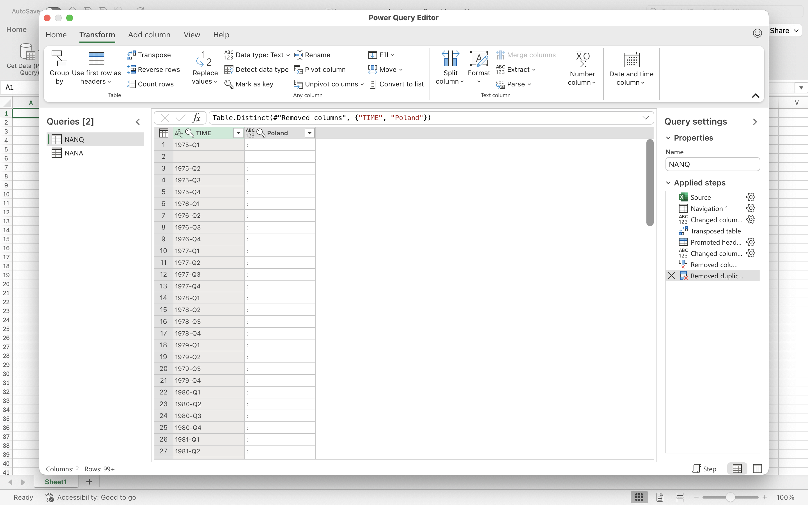
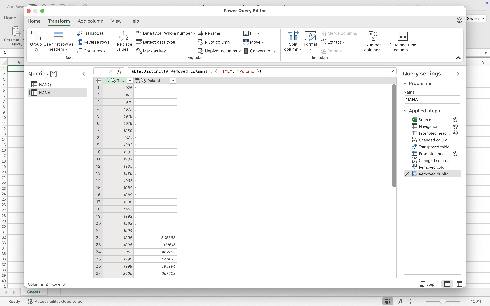
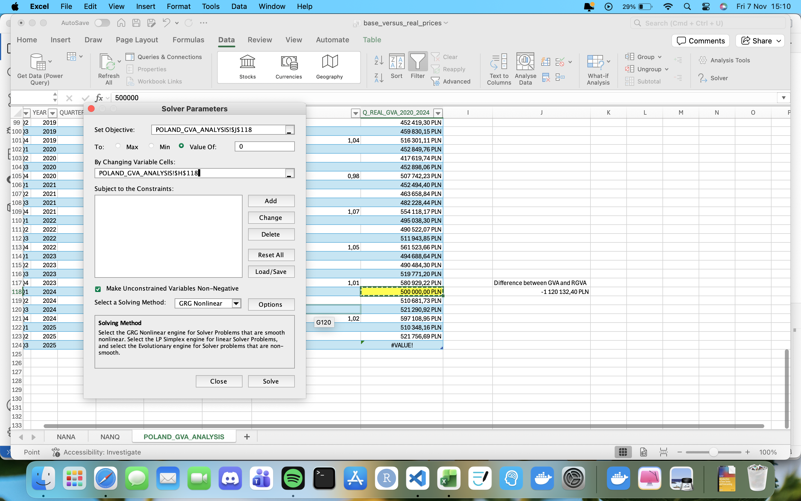
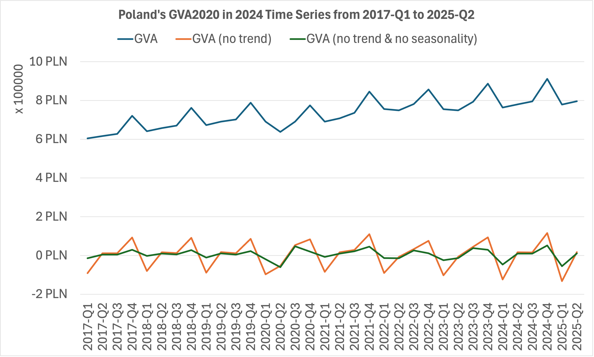
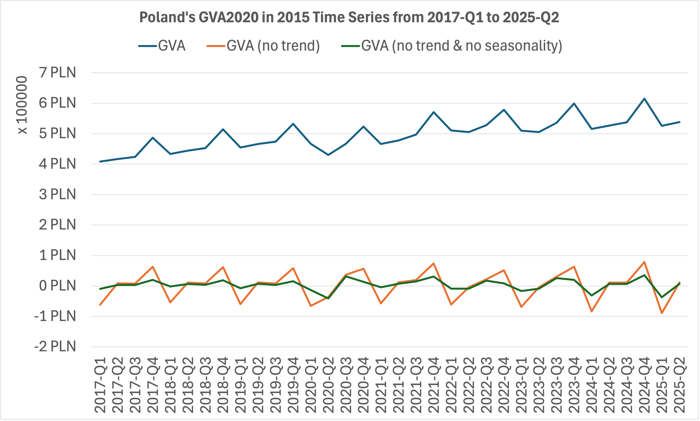

# Laboratory 02: Analysis of Base-Year and Constant-Price Valuations

Retrieve data on Gross Value Added for 2020 (GVA2020) for Poland from [Eurostat](https://ec.europa.eu/eurostat)including quarterly data for gross value added at 2020 prices and annual data at current (nominal) prices.

From the available datasets, extract information for Poland and save it in CSV format for further analysis. Next, determine how the value of GVA changes over time by calculating chain-linked indices for both quarterly and annual data. Based on these indices, derive constant-price valuations of GVA relative to the base years 2024 and 2015.

Estimate the values of GVA for 2024-Q1 and 2015-Q1 using built-in estimation tools in Excel and R, ensuring that the results are consistent with the actual annual data at current prices.

Finally, use the dataset prepared in Laboratory 01 to compare how the shape of the time series has changed after accounting for constant prices. Present the results with clear charts and include a concise summary of the data sources, applied methods, and conclusions.

# Solution

Under the path `data/eurostat`, there are raw data downloaded from Eurostat. They separately present the gross value added (GVA) at quarterly prices for the year 2020 and the gross value added at nominal annual prices. From the available sources, I selected data for Poland and saved them in **CSV** format in the file `processed_data.csv`.

The next step was to calculate the chain index, which shows how the value of a phenomenon changed in a given period compared to the previous one. The following mathematical formula is used for this purpose.

$$
\text{CI}_{t} = \frac{y_t}{y_{t-1}}
$$

In the case of gross value added analysis, $y_t = \text{GVA(2020)}_t$.

$$
\text{CI}_t = \frac{\text{GVA(2020)}_t}{\text{GVA(2020)}_{t-1}}
$$

In my analysis, I calculated chain indices for both quarterly and annual periods:

- $\text{QCI}_t$: chain index for quarterly prices, where $t\in \{1995_{1}, 1995_{2}, 1995_{3}, 1995_{4}, 1996_{1}, ...\}$,
- $\text{ACI}_t$: chain index for annual prices, where $t\in \{1995, 1996, ...\}$.

Let us denote the constant prices of gross value added as $\text{RGVA}(t_c,t_r)$, where $t_c$ denotes the reference year, and $t_r$ the year relative to which we examine constant prices.

By performing a simple check, we quickly notice that $\sum_{i=1}^{4}{\text{GVA}(2020)_{2024_{i}}} \neq \text{RGVA}(2020, 2024)_{2024}$. This is the result of, among other things, the impact of inflation. Since the quarterly data are relative to the year 2020, the constant prices for 2024 will be higher, which is exactly what happened in this case:
- $\sum_{i=1}^{4}{\text{GVA}(2020)_{2024_{i}}} = \text{2,424,088.00 PLN}$,
- $\text{RGVA}(2020, 2024)_{2024} = \text{3,249,214.00 PLN}$.

The next step was to calculate the series prices relative to the year 2024. These data are easily available, also on the Eurostat website, but they can be calculated very simply using the existing dataset.

1. Set any default value for $\text{RGVA}(2020, 2024)_{2024_{1}}$, for example, let it be \text{500,000 PLN}$.
2. For all other quarters, calculate $\text{RGVA}(2020, 2024)_{t}$ using the following formula:
   - For $t > 2024_{1}$, $\text{RGVA}(2020, 2024)_{t} = \text{RGVA}(2020, 2024)_{t-1} \times \text{CI}_{t}$, 
   - For $t < 2024_{1}$, $\text{RGVA}(2020, 2024)_{t} = \frac{\text{RGVA}(2020, 2024)_{t+1}}{\text{CI}_{t+1}}$
3. Using built-in tools (for example, `Solver` in Excel), calculate the correct value of $\text{RGVA}(2020, 2024)_{2024_{1}}$.

*It should be noted that estimation tools calculate values with some approximation. In this experiment, the difference was \text{1.12 PLN}.*

An identical operation was carried out for constant prices according to the year 2015.

Then, I copied the files from the previous task with a ready-made template for trend and seasonality removal of the data. Below I present the results along with the chart from the previous laboratory.

By taking into account constant instead of nominal prices, the GVA curve was stripped of the trend caused by inflation. However, it is important to note that we did not remove the trend caused by other factors, which may prove useful in further analysis of this phenomenon. What should be emphasized, however, is that in the case of the series I analyzed, the slope of the trend line largely depends on the inflation factor.
